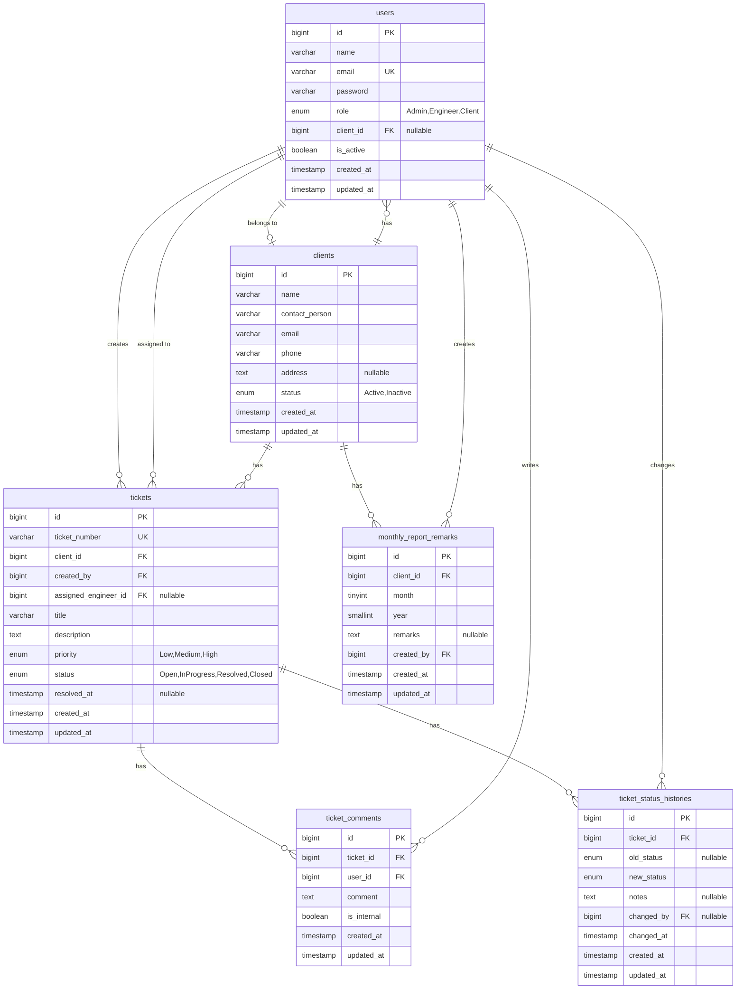

# Mini Helpdesk Portal

The **Mini Helpdesk Portal** is a web-based IT support ticket management application built with **Laravel 13**, **Livewire 4**, **Flux UI**, and **Tailwind CSS v4**. It features a robust role-based access control system (Admin, Engineer, Client) designed to facilitate ticket creation, assignment, comment collaboration, status auditing, and monthly reporting.

---

## Technical Stack
- **Framework**: Laravel 13
- **Frontend Interactivity**: Livewire 4 & Flux UI
- **Styling**: Tailwind CSS v4
- **Testing Suite**: Pest PHP v4
- **Supported Databases**: SQLite / MySQL / PostgreSQL

---

## Screenshots

### Admin Dashboard


<details>
<summary><b>View More Screenshots</b></summary>

#### Tickets List


#### Ticket Detail & Live Updates


#### Monthly Support Report


#### Monthly Support Report (Print View)


#### Clients List


#### Users List


#### Create Client Form


#### Edit User Form


#### Edit Ticket Form


</details>

---

## Entity-Relationship Diagram (ERD)

The database schema structure and relationships are modeled as follows:



---

## Database Migrations & Schema

The application database schema is initialized using Laravel migrations. It contains the following core tables:

1.  **`clients`**: Stores companies using the support portal. Status can be `Active` or `Inactive`.
2.  **`users`**: Stores user accounts. Users have roles (`Admin`, `Engineer`, `Client`) and can be deactivated. Client-role users are linked to a client via `client_id`.
3.  **`tickets`**: Tracks support requests. Supports automated sequential ticket numbering (e.g., `TCK-202607-0001` generated safely inside database transactions via locks).
4.  **`ticket_comments`**: Holds ticket conversation threads. Supports internal comments (`is_internal = true`) which are hidden from clients.
5.  **`ticket_status_histories`**: Automatically logs an audit trail of ticket status transitions, tracking who changed the status, when, and any accompanying transition notes.
6.  **`monthly_report_remarks`**: Stores executive summary reviews written by Admins for monthly client reports.

---

## Installation & Setup

Follow these steps to run the application locally:

### 1. Prerequisites
Ensure you have the following installed on your system:
- **PHP 8.5** or higher (with extensions: `mbstring`, `xml`, `sqlite3`, `curl`)
- **Composer**
- **Node.js** & **NPM**

### 2. Clone and Install Dependencies
```bash
# Clone the repository
git clone https://github.com/aqilamuzafa/mini-helpdesk.git
cd mini-helpdesk

# Install PHP dependencies
composer install

# Install Front-End assets
npm install
```

### 3. Environment Configuration
Copy the template `.env` file and generate the application key:
```bash
cp .env.example .env
php artisan key:generate
```

*By default, the `.env` uses an SQLite database. If SQLite is preferred, create the database file:*
```bash
touch database/database.sqlite
```

### 4. Run Migrations & Seeders
Populate the database with structure and realistic demo data (at least 10+ tickets across multiple clients and statuses):
```bash
php artisan migrate --seed
```

### 5. Running the Application
Launch the local development environment:

```bash
composer run dev
```
Open your browser and navigate to the application URL (typically `http://localhost:8000`).

---

## Seeded Demo Credentials

Use the following seeded credentials to log in:

- **Admin User**:
  - **Email**: `admin@example.com`
  - **Password**: `password123`
- **Engineer User**:
  - **Email**: `engineer1@example.com`
  - **Password**: `password123`
- **Client User**:
  - **Email**: `client1@example.com`
  - **Password**: `password123`

---

## Running Tests

Verify application stability and test suite status:
```bash
# Run Pest test suite
php artisan test --compact
```

---

## Role-Based Access Control (RBAC)

The portal implements strict role-based access control (Admin, Engineer, and Client) mapped via Laravel policies, route middleware, and query scopes:

### Roles & Scoped Capabilities

| Role | Target Entities | Permitted Actions | Scoping / Limitations |
| :--- | :--- | :--- | :--- |
| **Admin** (`admin`) | Clients, Users, Tickets, Reports, Comments | Full CRUD access to all models. Can assign engineers, change priorities, submit internal comments, and enter executive remarks for client reports. | No scoping limits; has visibility over the entire dataset. |
| **Engineer** (`engineer`) | Tickets, Comments | View assigned tickets, edit status, add comments (both public and internal). | Scoped strictly to tickets where `assigned_engineer_id` is their own ID. Cannot access client/user management or edit ticket metadata (priority, client, assignment). |
| **Client User** (`client`) | Tickets, Comments, Reports | View own tickets, create tickets, add comments (public only). View own client's monthly report. | Scoped strictly to their associated `client_id`. Cannot access client/user management, update status/priority, assign engineers, or read/post internal comments. |

### Technical Enforcement

1. **Eloquent Query Scope (`scopeVisibleTo`)**:
   Centralizes data visibility constraints on the `Ticket` model to ensure that queries automatically restrict lists and dashboard widgets based on the active session's user role:
   ```php
   public function scopeVisibleTo(Builder $query, User $user): Builder
   {
       return match ($user->role) {
           Role::Admin    => $query,
           Role::Engineer => $query->where('assigned_engineer_id', $user->id),
           Role::Client   => $query->where('client_id', $user->client_id),
       };
   }
   ```
2. **Laravel Policies**:
   Enforces identical logic at the individual record/action level (e.g. `TicketPolicy::view`, `TicketPolicy::update`, `TicketCommentPolicy::create`). This guarantees that single-record queries and action authorizations are always consistent with list-level query scopes.
3. **HTTP / Request Validation Gating**:
   Input restrictions (like blocking client users from updating ticket status or blocking engineers from changing priorities) are validated at the HTTP layer using custom form requests (`StoreTicketRequest`, `UpdateTicketRequest`). Unpermitted operations return `403 Forbidden` responses.
4. **Inactive User Gating**:
   If a client user or engineer's active status (`is_active`) is set to `false`, they are denied login access with a generic credential error to prevent account discovery.

---

## Folder Structure

The project follows a standard Laravel directory layout. Below are the key directories containing the custom business logic of this helpdesk:

```
mini-helpdesk/
├── app/
│   ├── Enums/                     # Backed PHP enums (Role, TicketStatus, Priority, ClientStatus)
│   ├── Http/
│   │   ├── Middleware/            # RoleMiddleware for route-level grouping
│   │   └── Requests/              # Form Requests for validation and authorization (StoreClientRequest, StoreUserRequest, etc.)
│   ├── Livewire/                  # Reactive frontend views
│   │   ├── Clients/               # Client list table and create/edit forms
│   │   ├── Dashboard/             # Role-specific dashboard views
│   │   ├── Reports/               # Monthly reports logic and print views
│   │   ├── Tickets/               # Ticket list table, forms, comments, and details view
│   │   └── Users/                 # User management table and forms
│   ├── Observers/                 # TicketObserver (automates sequential number generation, resolved_at timestamps, audit logs)
│   ├── Policies/                  # Scoped authorization logic (TicketPolicy, ClientPolicy, etc.)
│   ├── Providers/                 # TicketObserverServiceProvider registration
│   └── Services/                  # Core services (TicketQueryService, TicketNumberService, DashboardMetricsService, MonthlyReportService)
├── database/
│   ├── migrations/                # Database schema structure migrations
│   └── seeders/                   # Database seeder producing realistic helpdesk datasets
├── resources/
│   ├── css/                       # CSS styles including Tailwind CSS v4 and Flux UI configurations
│   └── views/                     # Custom Blade views (e.g., reports print layout, layout templates)
└── tests/
    ├── Feature/                   # Role and module feature tests (using Pest v4)
    └── Unit/                      # Isolated service logic and observer tests
```

---

## Technical Features & Implementation Highlights

- **Safe Sequential Ticket Numbers**: Tickets are assigned unique sequential codes (e.g., `TKT-00001`) via a pessimistic lock (`lockForUpdate`) on the database within a transaction, completely eliminating race conditions.
- **Audit Trails**: Every status change generates an entry in the `ticket_status_histories` table, logging the original status, new status, transition timestamp, and the user who executed the update.
- **Doughnut Charts**: Live dashboards render Chart.js doughnut graphs dynamically reflecting ticket status distributions for the logged-in user or client.
- **Print Layout**: Monthly reports include a clean print-ready layout (gated at `/reports/monthly/print`) stripped of navigation menus and sidebar elements.
- **No Hard-Deletes**: Client entities and tickets are never deleted; instead, clients use `status` states (`Active` or `Inactive`) and users are toggled via `is_active` to safeguard audit integrity.

---

## Future Scope / Limitations

- **Email Notifications**: Currently, there are no live email notifications. Integrating queues and notification dispatchers for status updates and comments would be a valuable expansion.
- **File Attachments**: Tickets are restricted to textual descriptions. Supporting image or document uploads in ticket creation and comments would improve triage capabilities.
- **SLA Tracking**: Implementing automated Service Level Agreement (SLA) timers with visual warnings when a ticket sits in `Open` or `InProgress` for too long.

---

## AI Usage Log

| Task | AI Tool Used | Prompt Summary | AI Output Used | Manual Review / Changes |
| :--- | :--- | :--- | :--- | :--- |
| **Initial Planning** | Claude | Generate implementation plan based on the technical assessment. | Initial implementation plan and project roadmap. | Adjusted the technology stack and selected Laravel 13 compatible libraries. |
| **Requirements, Design & Task Breakdown** | Kiro | Generate detailed requirements, architecture, and implementation tasks from the assessment document. | Requirements, design documents, and task breakdown. | Reviewed and refined the requirements to match the original assessment specification. |
| **Foundation (Enums, Models, Migrations, Factories & Seeders)** | Antigravity | Implement the project foundation including database schema and Eloquent models. | Enums, migrations, models, factories, and seeders. | Reviewed database relationships, verified migrations and seed data, and confirmed they matched the required ERD. |
| **Ticket Number & Observer** | Antigravity | Implement TicketNumberService, TicketObserver, and related tests. | Ticket number generation, observer, and Pest tests. | Reviewed the observer implementation, refined the status history logic, and verified the behavior through testing. |
| **Authentication & RBAC** | Antigravity | Implement authentication, role middleware, policies, role-based routing, and feature tests. | Authentication flow, middleware, policies, routes, and RBAC tests. | • Reviewed the implementation, verified role-based access, and confirmed all feature tests passed.<br>• Updated authentication and authorization to block inactive client users, verified historical data remained accessible. |
| **Client Form Requests** | Antigravity | Implement StoreClientRequest and UpdateClientRequest. | Form Request classes with validation and authorization rules. | Reviewed validation rules, authorization logic, and verified create/update scenarios. |
| **Client Table** | Antigravity | Implement the ClientTable Livewire component and Blade UI. | Livewire component, Blade UI, search, filtering, pagination, and status toggle. | • Replaced the original table approach with a standard Tailwind table after verifying the available Flux components.<br>• Reviewed search, filtering, pagination, authorization, and verified database queries and UI behavior. |
| **Client Form** | Antigravity | Implement the ClientForm Livewire component. | Create/Edit Client form, validation, and persistence logic. | Reviewed form validation, authorization, and verified create and update workflows. |
| **Client Management Tests** | Antigravity | Generate feature tests for Client Management. | Pest feature tests. | Reviewed the test scenarios and verified CRUD and authorization behavior. |
| **User Management** | Antigravity | Implement User Management module. | User table, form, validation, and feature tests. | Reviewed role assignment, validation, authorization, and tested CRUD operations. |
| **Ticket Module** | Antigravity | Implement ticket workflow, comments, access control, and feature tests. | Ticket CRUD, comments, workflow, query service, and tests. | Reviewed ticket workflow, authorization, status history, and verified business rules through testing. |
| **Ticket Detail** | Antigravity | Implement TicketDetail component and Blade view. | Livewire component and Blade view. | • Fixed an AI-generated error by replacing the undefined uppercase() function with strtoupper() and verified the status history page.<br>• Fixed an AI-generated typo by replacing the invalid Role::Model enum reference with the correct role checks (Role::Admin and Role::Engineer), then verified all tests passed. |
| **Dashboard** | Antigravity | Implement dashboard metrics and role-specific dashboards. | Dashboard components and database queries. | Reviewed metric calculations, verified aggregation queries, and compared results against seeded data. |
| **Monthly Report** | Antigravity | Implement monthly report generation and print view. | Monthly report service, Livewire component, print view, and tests. | • Reviewed report calculations, filtering logic, and validated printed output.<br>• Added report generation timestamp.<br>• Added ticket resolved date. |
| **Final Testing & Documentation** | ChatGPT | Generate README structure and documentation template. | README draft and documentation structure. | Completed installation guide, architecture explanation, AI Usage Log, and verified the project using a clean installation and seeded database. |
