# Mini Helpdesk Portal

The **Mini Helpdesk Portal** is a web-based IT support ticket management application built with **Laravel 13**, **Livewire 4**, **Flux UI**, and **Tailwind CSS v4**. It features a robust role-based access control system (Admin, Engineer, Client) designed to facilitate ticket creation, assignment, comment collaboration, status auditing, and monthly reporting.

---

## Features

- **Authentication**: Gated login access and session management scaffolded with Laravel Fortify.
- **Role-Based Access**: Scoped views and action restriction using Laravel Policies and Eloquent scopes.
- **Client Management**: Admin CRUD interface to register and activate/deactivate client companies.
- **User Management**: Admin CRUD interface to register portal users with role assignments and password hashing.
- **Ticket Management**: Scoped ticket dashboard, status transitions, priority levels, and assignment controls.
- **Ticket Comments**: Collaborative comment feeds supporting both public messages and staff-only internal notes.
- **Dashboard**: Live dashboards displaying metrics and status distribution charts dynamically calculated per role.
- **Monthly Report**: Activity reports per client including printable layouts and Admin executive summary remarks.
- **Status History**: Automated audit trail logging for all ticket status transitions.

---

## Technical Stack

- **Framework**: Laravel 13
- **Frontend Interactivity**: Livewire 4 & Flux UI
- **Styling**: Tailwind CSS v4
- **Testing Suite**: Pest PHP v4
- **Supported Databases**: SQLite / MySQL / PostgreSQL

---

## Screenshots

### Admin Dashboard
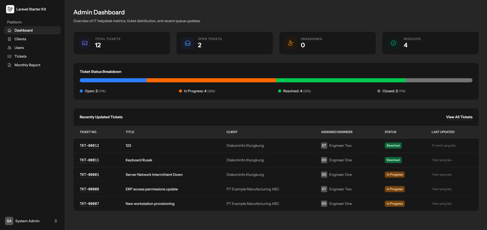

<details>
<summary><b>View More Screenshots</b></summary>

#### Tickets List
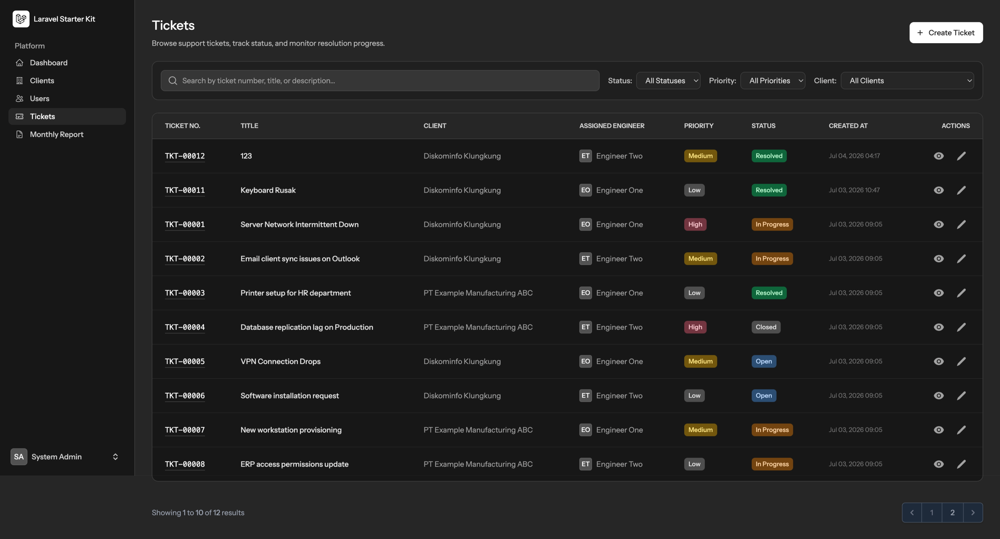

#### Ticket Detail & Live Updates
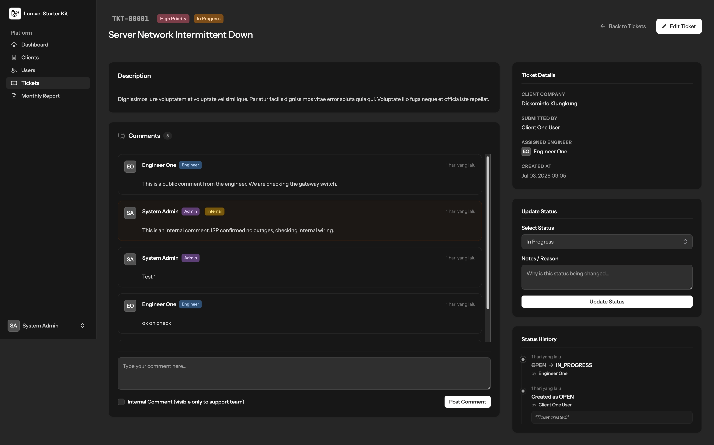

#### Monthly Support Report
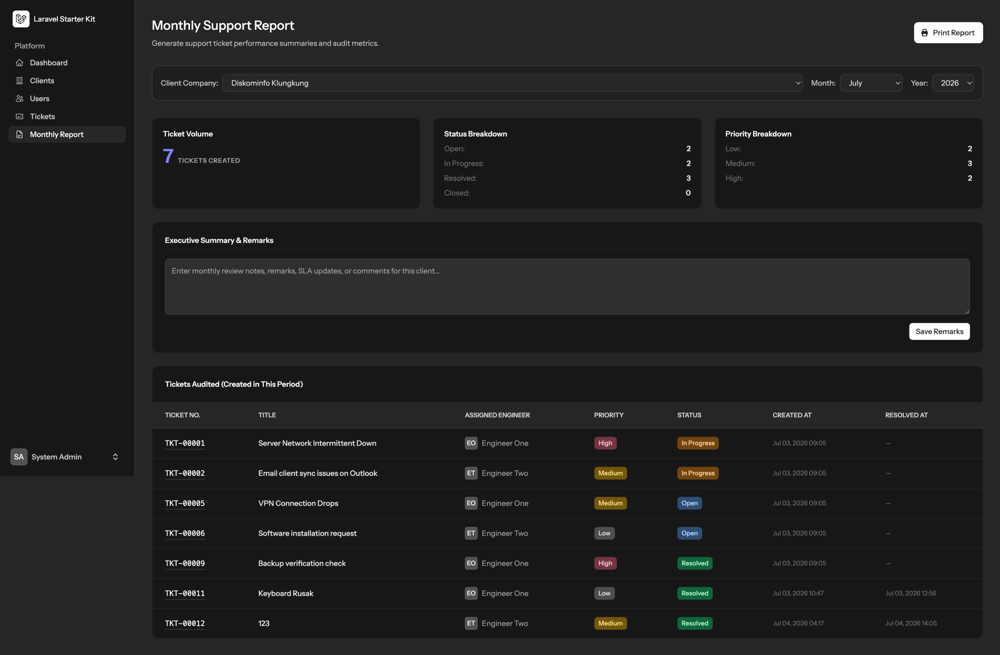

#### Monthly Support Report (Print View)
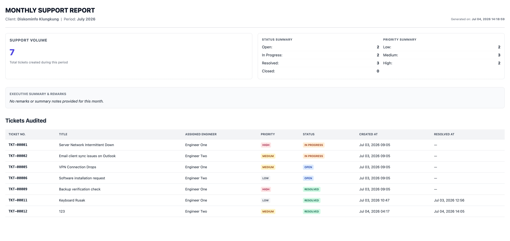

#### Clients List
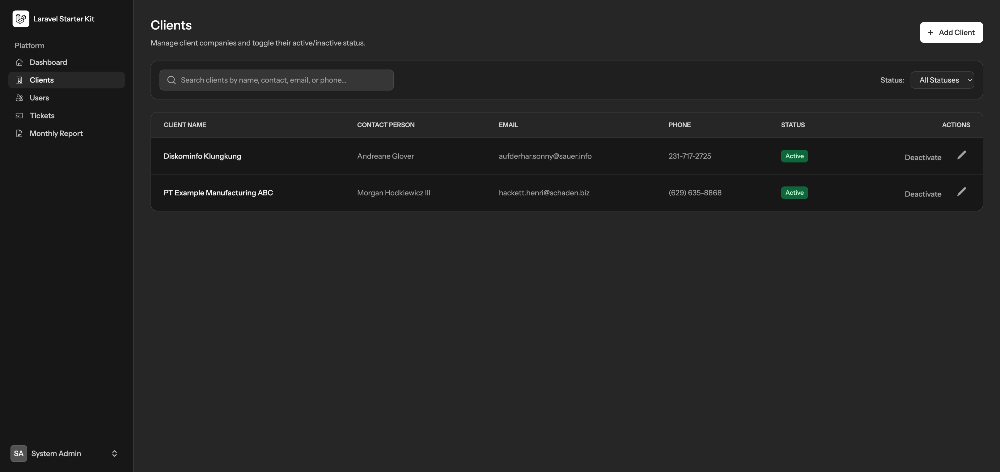

#### Users List
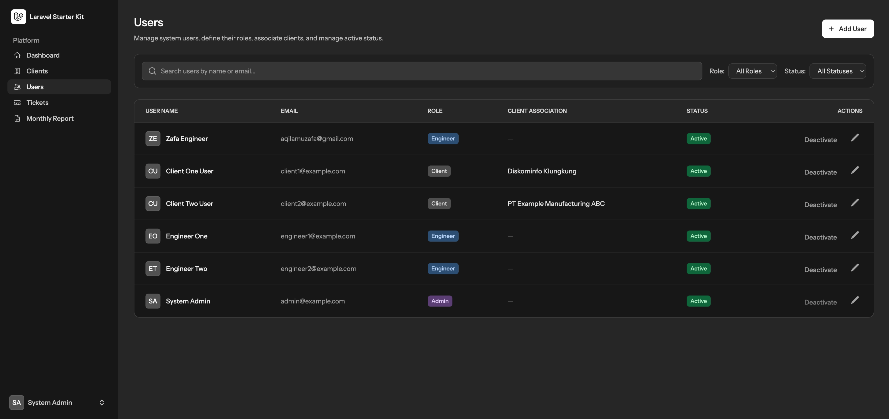

#### Create Client Form
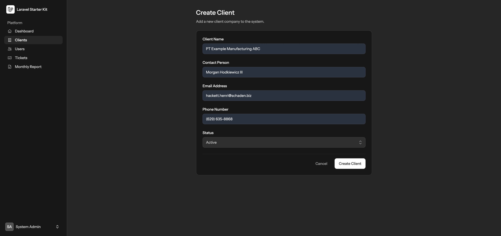

#### Edit User Form
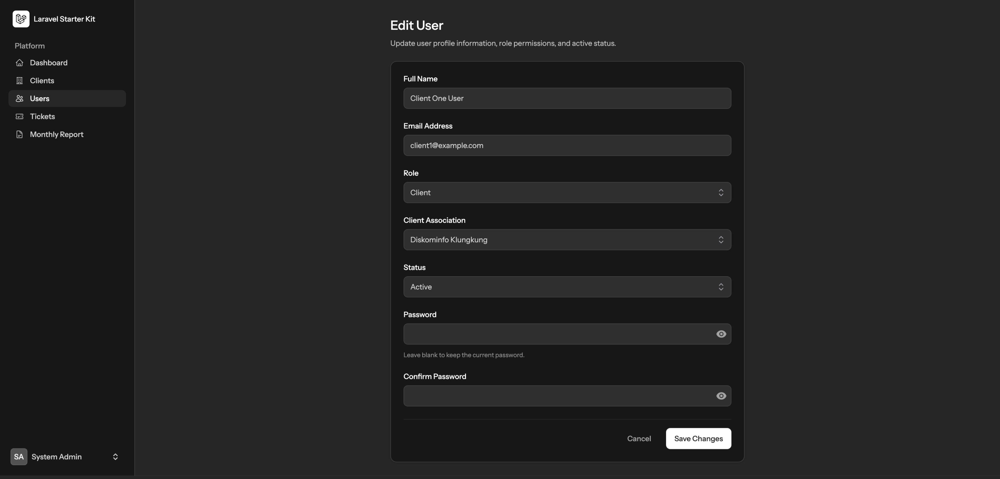

#### Edit Ticket Form
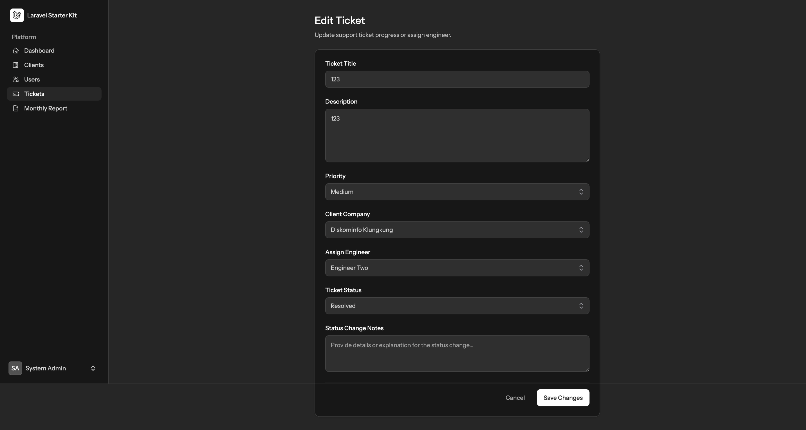

</details>


---

## Installation & Setup

Follow these steps to run the application locally:

### 1. Prerequisites
Ensure you have the following installed on your system:
- **PHP 8.5** or higher (with extensions: `mbstring`, `xml`, `sqlite3`, `curl`)
- **Composer**
- **Node.js** & **NPM**

### 2. Clone and Install Dependencies
```bash
# Clone the repository
git clone https://github.com/aqilamuzafa/mini-helpdesk.git
cd mini-helpdesk

# Install PHP dependencies
composer install

# Install Front-End assets
npm install
```

### 3. Environment Configuration
Copy the template `.env` file and generate the application key:
```bash
cp .env.example .env
php artisan key:generate
```

*By default, the `.env` uses an SQLite database. If SQLite is preferred, create the database file:*
```bash
touch database/database.sqlite
```

### 4. Run Migrations & Seeders
Populate the database with structure and realistic demo data (at least 10+ tickets across multiple clients and statuses):
```bash
php artisan migrate --seed
```

### 5. Running the Application
Launch the local development environment:

```bash
composer run dev
```
Open your browser and navigate to the application URL (typically `http://localhost:8000`).

### Alternative: Running with Docker (docker-compose)

If you prefer to run the application in isolated Docker containers, we have pre-configured `docker-compose.yml` and `docker/` setups:

1.  Make sure **Docker Desktop** is installed and running.
2.  Copy `.env.example` to `.env` and configure the database settings to use MySQL:
    ```env
    DB_CONNECTION=mysql
    DB_HOST=mysql
    DB_PORT=3306
    DB_DATABASE=mini_helpdesk
    DB_USERNAME=root
    DB_PASSWORD=root
    ```
3.  Build and start the containers in the background:
    ```bash
    docker-compose up -d --build
    ```
4.  Install dependencies, generate key, and seed the database inside the containers:
    ```bash
    # Install PHP dependencies
    docker-compose exec app composer install

    # Generate app encryption key
    docker-compose exec app php artisan key:generate

    # Run database migrations and seed realistic demo data
    docker-compose exec app php artisan migrate --seed
    ```
5.  Build assets (or keep Vite watcher running):
    ```bash
    # Run once
    npm install && npm run build
    ```
6.  Access the services:
    - **Web Application**: Navigate to `http://localhost:8080` (routed via Alpine Nginx container).
    - **Mailpit (Local Mail Inbox)**: Navigate to `http://localhost:8025` to inspect outbound emails.

To stop the containers, run:
```bash
docker-compose down
```

---

## Seeded Demo Credentials

Use the following seeded credentials to log in:

- **Admin User**:
  - **Email**: `admin@example.com`
  - **Password**: `password123`
- **Engineer User**:
  - **Email**: `engineer1@example.com`
  - **Password**: `password123`
- **Client User**:
  - **Email**: `client1@example.com`
  - **Password**: `password123`

---

## Testing

- **Pest PHP v4** testing suite.
- **89 Feature & Unit Tests** with **375 Assertions** asserting complete code coverage and RBAC safety.
- Run the tests using:
```bash
php artisan test --compact
```

---

## Architecture & Design Decisions

### Architecture Diagram

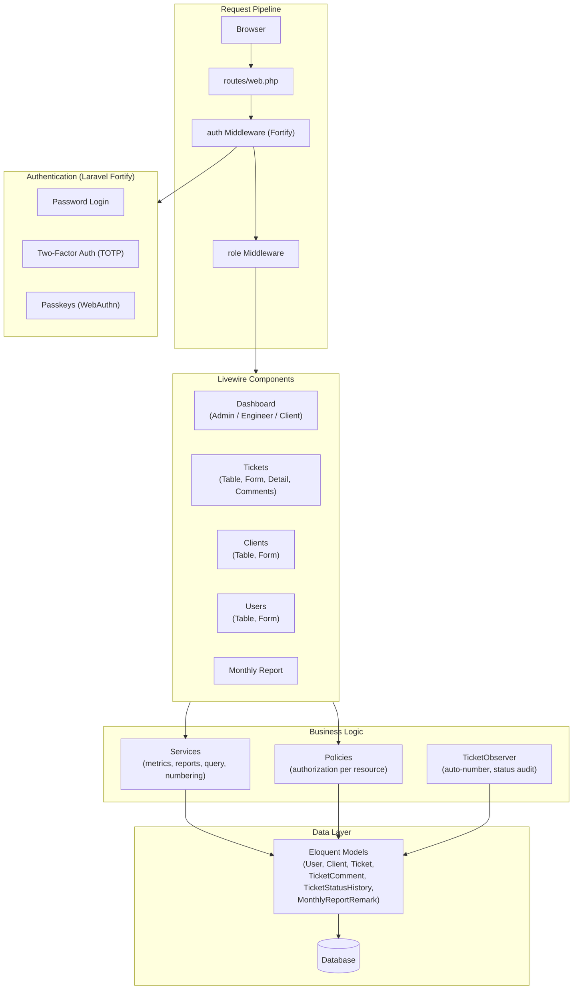

### Design Decisions

- **Why Observer?**
  Automatically generates sequential ticket numbers and writes status history to the audit log on update, avoiding duplication of side-effect logic across different components/controllers.
- **Why Policies?**
  Encapsulates individual resource-level authorization checks (e.g. view, update) mapping directly to Laravel's gate system.
- **Why `scopeVisibleTo()`?**
  Centralizes role-based ticket visibility constraints in one place so that lists, dropdowns, and dashboards all query the exact same scoped dataset.
- **Why Services?**
  Keeps business logic (ticket number sequence logic, monthly report generation, dashboard aggregates) clean, decoupled, and easily testable outside of Livewire classes.

### Technical Implementation Highlights
- **Sequential Ticket Numbers**: Uses database transactions with pessimistic locking (`lockForUpdate`) to safely generate sequential ticket numbers under concurrent requests.
- **Automatic Status Audits**: Automatically logs status transitions and timestamps to the `ticket_status_histories` table whenever a ticket changes status.
- **Live Aggregates**: Dashboards display metrics calculated directly from database queries with no hardcoded values.
- **Print-Optimized Monthly Reports**: Monthly reports contain a gated, print-ready view stripped of sidebars and navigation menus.
- **Soft Status Toggles**: Clients and users are deactivated via state flags (`status` and `is_active`) rather than database deletion to preserve historical relationship integrity.

### Role-Based Access Control (RBAC)

The portal implements strict role-based access control (Admin, Engineer, and Client) mapped via Laravel policies, route middleware, and query scopes:

- **Admin (`admin`)**: Full CRUD access. Can manage clients/users, view all tickets, assign engineers, change priorities, and submit internal comments.
- **Engineer (`engineer`)**: View assigned tickets, edit ticket status, and add comments (public & internal). Cannot access client/user management.
- **Client User (`client`)**: View own tickets, create tickets, add public comments, and view own monthly reports. Cannot update status, priority, or access admin sections.

---

## Entity-Relationship Diagram (ERD)

The database schema structure and relationships are modeled as follows:

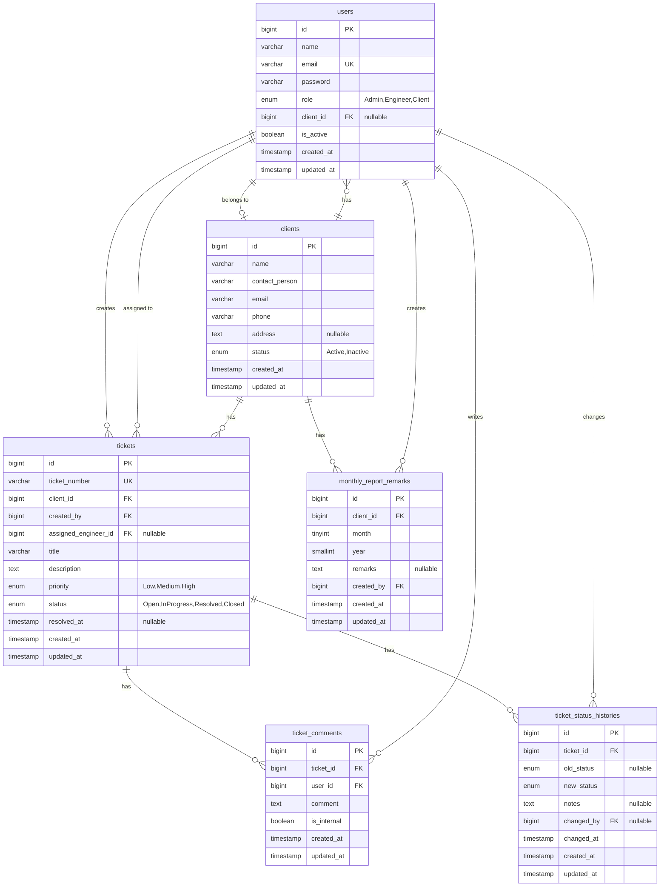

---


## AI Usage Log

| Task | AI Tool Used | Prompt Summary | AI Output Used | Manual Review / Changes |
| :--- | :--- | :--- | :--- | :--- |
| **Initial Planning** | Claude | Generate implementation plan based on the technical assessment. | Initial implementation plan and project roadmap. | Adjusted the technology stack and selected Laravel 13 compatible libraries. |
| **Requirements, Design & Task Breakdown** | Kiro | Generate detailed requirements, architecture, and implementation tasks from the assessment document. | Requirements, design documents, and task breakdown. | Reviewed and refined the requirements to match the original assessment specification. |
| **Foundation (Enums, Models, Migrations, Factories & Seeders)** | Antigravity | Implement the project foundation including database schema and Eloquent models. | Enums, migrations, models, factories, and seeders. | Reviewed database relationships, verified migrations and seed data, and confirmed they matched the required ERD. |
| **Ticket Number & Observer** | Antigravity | Implement TicketNumberService, TicketObserver, and related tests. | Ticket number generation, observer, and Pest tests. | Reviewed the observer implementation, refined the status history logic, and verified the behavior through testing. |
| **Authentication & RBAC** | Antigravity | Implement authentication, role middleware, policies, role-based routing, and feature tests. | Authentication flow, middleware, policies, routes, and RBAC tests. | • Reviewed the implementation, verified role-based access, and confirmed all feature tests passed.<br>• Updated authentication and authorization to block inactive client users, verified historical data remained accessible. |
| **Client Form Requests** | Antigravity | Implement StoreClientRequest and UpdateClientRequest. | Form Request classes with validation and authorization rules. | Reviewed validation rules, authorization logic, and verified create/update scenarios. |
| **Client Table** | Antigravity | Implement the ClientTable Livewire component and Blade UI. | Livewire component, Blade UI, search, filtering, pagination, and status toggle. | • Replaced the original table approach with a standard Tailwind table after verifying the available Flux components.<br>• Reviewed search, filtering, pagination, authorization, and verified database queries and UI behavior. |
| **Client Form** | Antigravity | Implement the ClientForm Livewire component. | Create/Edit Client form, validation, and persistence logic. | Reviewed form validation, authorization, and verified create and update workflows. |
| **Client Management Tests** | Antigravity | Generate feature tests for Client Management. | Pest feature tests. | Reviewed the test scenarios and verified CRUD and authorization behavior. |
| **User Management** | Antigravity | Implement User Management module. | User table, form, validation, and feature tests. | Reviewed role assignment, validation, authorization, and tested CRUD operations. |
| **Ticket Module** | Antigravity | Implement ticket workflow, comments, access control, and feature tests. | Ticket CRUD, comments, workflow, query service, and tests. | Reviewed ticket workflow, authorization, status history, and verified business rules through testing. |
| **Ticket Detail** | Antigravity | Implement TicketDetail component and Blade view. | Livewire component and Blade view. | • Fixed an AI-generated error by replacing the undefined uppercase() function with strtoupper() and verified the status history page.<br>• Fixed an AI-generated typo by replacing the invalid Role::Model enum reference with the correct role checks (Role::Admin and Role::Engineer), then verified all tests passed. |
| **Dashboard** | Antigravity | Implement dashboard metrics and role-specific dashboards. | Dashboard components and database queries. | Reviewed metric calculations, verified aggregation queries, and compared results against seeded data. |
| **Monthly Report** | Antigravity | Implement monthly report generation and print view. | Monthly report service, Livewire component, print view, and tests. | • Reviewed report calculations, filtering logic, and validated printed output.<br>• Added report generation timestamp.<br>• Added ticket resolved date. |
| **Final Testing & Documentation** | ChatGPT | Generate README structure and documentation template. | README draft and documentation structure. | Completed installation guide, architecture explanation, AI Usage Log, and verified the project using a clean installation and seeded database. |

---

## Future Improvements

- **File Attachments**: Support uploading images or documents to tickets and comment threads.
- **Email Notifications**: Dispatch notifications via queues on ticket creation, status changes, and new comments.
- **SLA Tracking**: Implement Service Level Agreement (SLA) timers with alert indicators for unresolved tickets.
